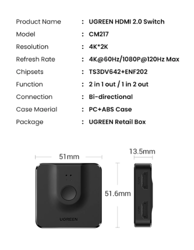
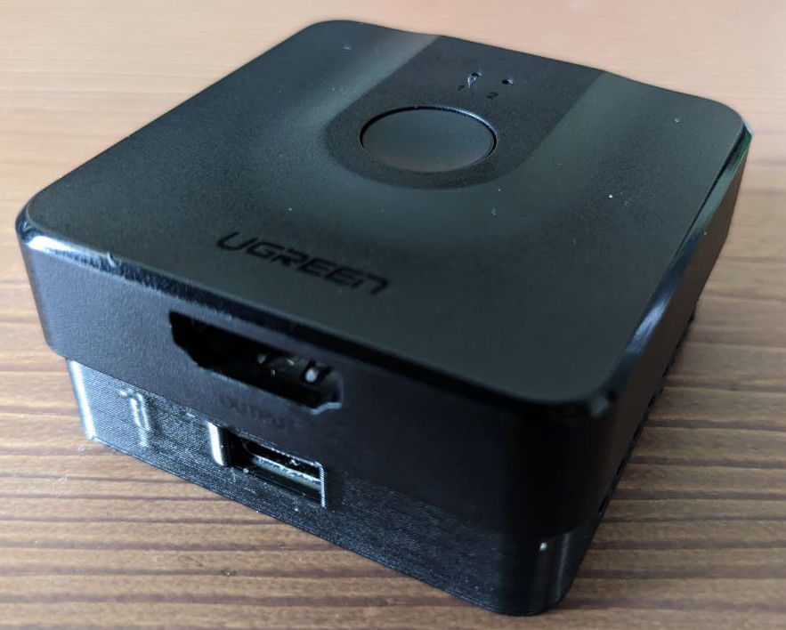
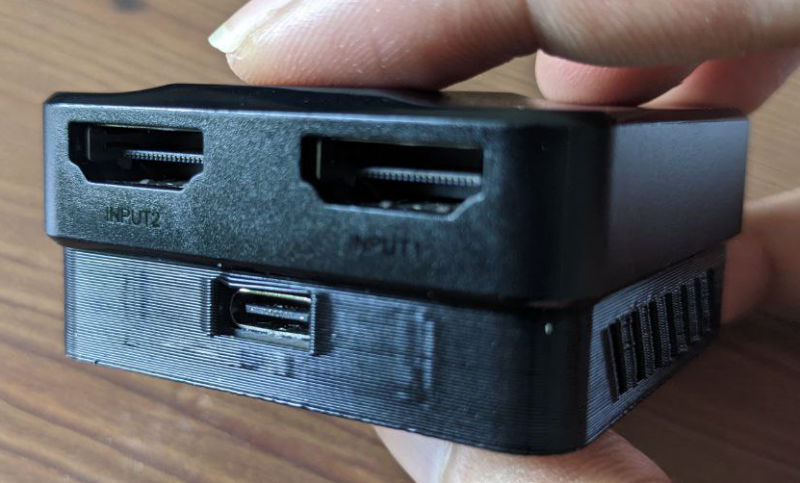
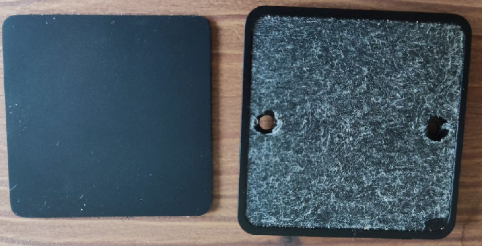
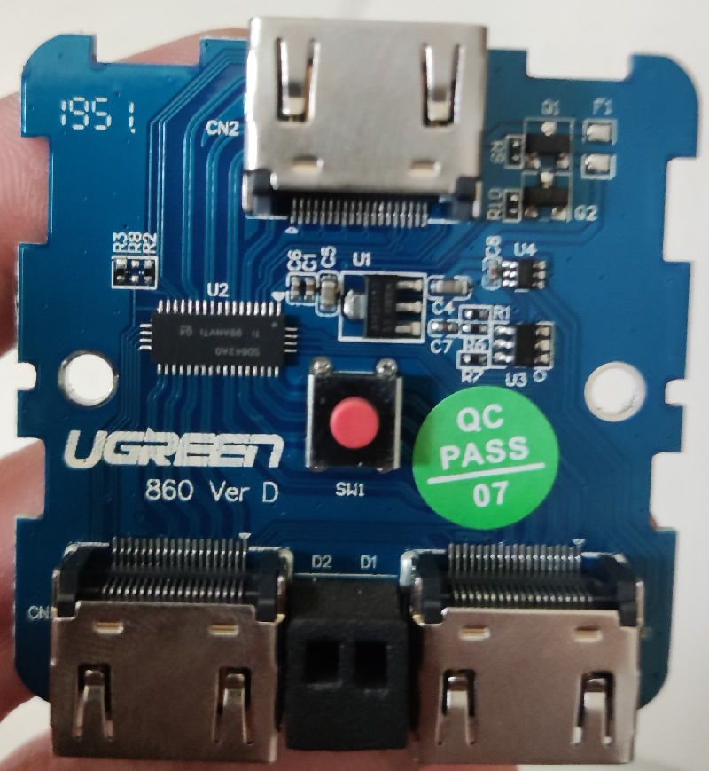
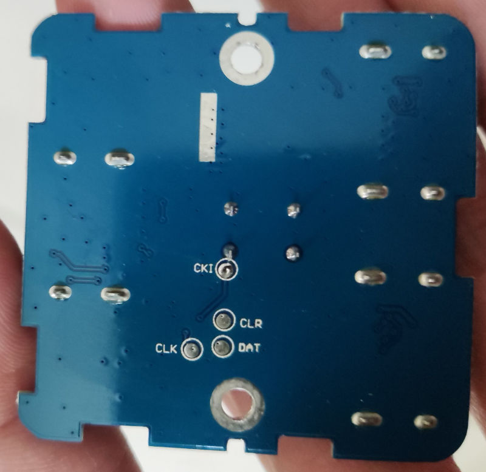
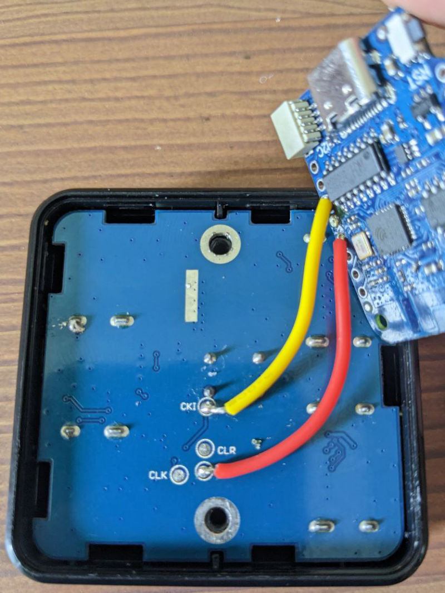
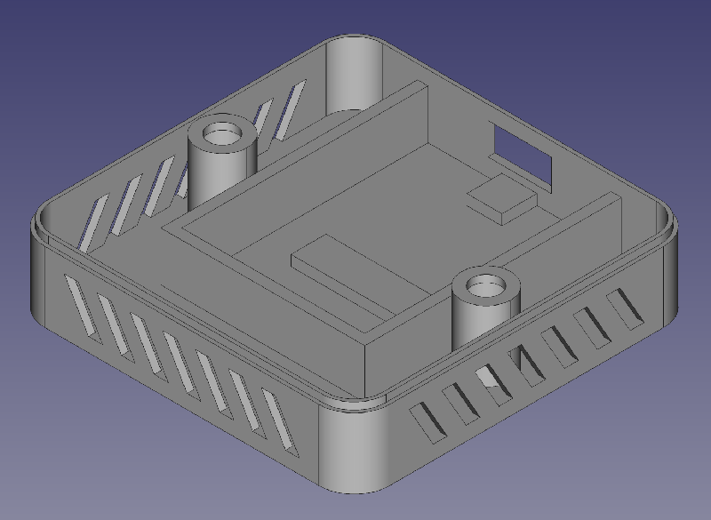
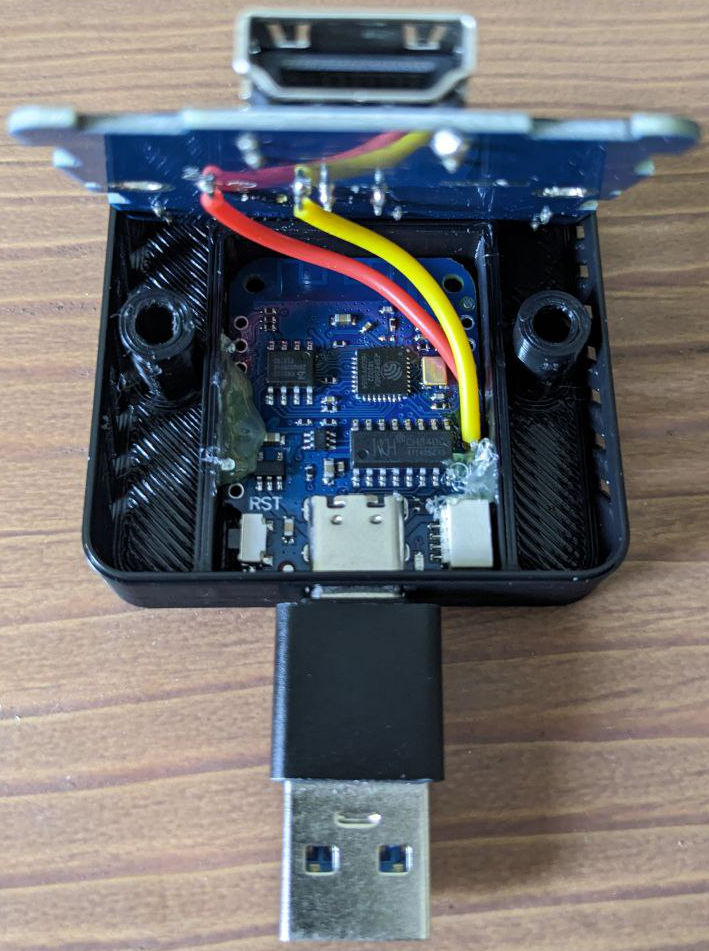
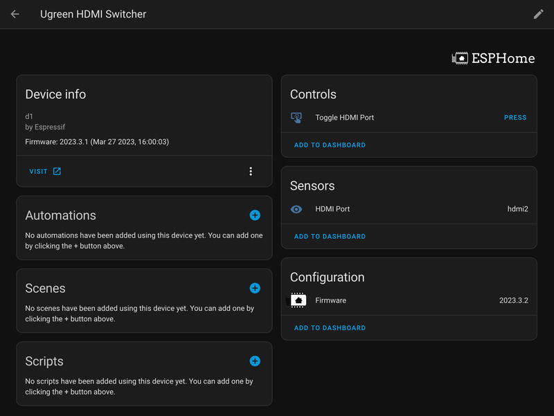

# ESPHome UGREEN HDMI Switcher
Control UGREEN HDMI Switcher/Splitter over WiFi using ESPHome. You can still control it with the physical button on top of the device.  
Demo video: https://youtu.be/F_oZo9kNero  

⚠️ **DISCLAIMER:** Nobody but you is responsible for any damage this mod may cause.  

  
  
You can put the USB port to the other side if you want to.  

  

## Parts  
1. UGREEN HDMI 2.0 Switch CM217 ([Aliexpress](https://www.aliexpress.com/item/32968528447.html)).  The one I got was manufactured in 2019.  
2. Wemos LOLIN D1 Mini ([Aliexpress](https://www.aliexpress.com/item/32529101036.html)).  Tested with version 4.0.  
3. Two small electric wires. I use the 24 AWG one.
4. Soldering station.
5. Glue gun.  
6. 3D Printer.  
7. Any USB Type C cable.
  
## Disassembly  
1. Peel off the pad at the bottom and unscrew the screws. We'll need these two screws later.  
2. Use something like a guitar pick to pry up the back. Don't worry if you damage the bottom part as you won't need it.  
3. Take the board out.
  
  
  
  
  

## Wiring
You'll only need two pins:
- Connect CKI port with Pin #2 (control the HDMI switching).  
- Connect DAT port with Pin #4 (contain value of the current HDMI port).  
- ⚠️ IMPORTANT
  - Connect the wires to the upper side of the board.  
  - Just to be safe, don't let the wire touch the pin next to CKI serial port.  
  - Make sure the wires are long enough so the USB port can be either put on the left or the right side.  

  

## 3D Printing
3D files are in `3d-files` folder.
My settings in Cura:
- Support: Tree  
- Layer height: 0.25  
- Layer width: 0.5  

  

## Assembly
1. Put the board into the case.  
2. Plug the USB Type C cable into the board to make sure that everything is lined up.  
3. Use glue gun to make the board stay in place.  
4. Put in the upper half then screw everything in together.  

  

## ESPHome code
Flash the board with ESPHome using the code in [`esphome-code.yaml`](esphome-code.yaml).

## Home Assistant Device
If everything works you should see something like this in Home Assistant. Use `Toggle HDMI Port` button to switching between the ports.  

  

### Thanks for reading. Good luck!  
